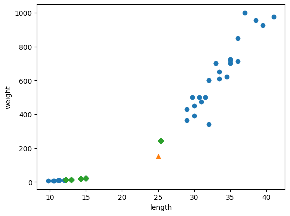
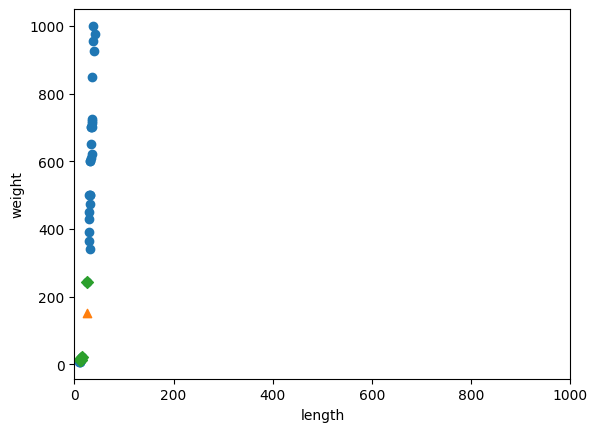
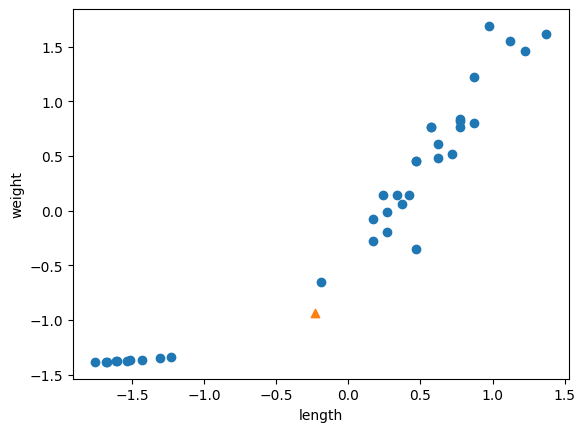

**인공지능 알고리즘 적용 -2**


```python
fish_length = [25.4, 26.3, 26.5, 29.0, 29.0, 29.7, 29.7, 30.0, 30.0, 30.7, 31.0, 31.0, 
                31.5, 32.0, 32.0, 32.0, 33.0, 33.0, 33.5, 33.5, 34.0, 34.0, 34.5, 35.0, 
                35.0, 35.0, 35.0, 36.0, 36.0, 37.0, 38.5, 38.5, 39.5, 41.0, 41.0, 9.8, 
                10.5, 10.6, 11.0, 11.2, 11.3, 11.8, 11.8, 12.0, 12.2, 12.4, 13.0, 14.3, 15.0]
fish_weight = [242.0, 290.0, 340.0, 363.0, 430.0, 450.0, 500.0, 390.0, 450.0, 500.0, 475.0, 500.0, 
                500.0, 340.0, 600.0, 600.0, 700.0, 700.0, 610.0, 650.0, 575.0, 685.0, 620.0, 680.0, 
                700.0, 725.0, 720.0, 714.0, 850.0, 1000.0, 920.0, 955.0, 925.0, 975.0, 950.0, 6.7, 
                7.5, 7.0, 9.7, 9.8, 8.7, 10.0, 9.9, 9.8, 12.2, 13.4, 12.2, 19.7, 19.9]
```


```python
import numpy as np

np.column_stack(([1,2,3],[4,5,6,]))
```


    array([[1, 4],
           [2, 5],
           [3, 6]])


```python
fish_data = np.column_stack((fish_length,fish_weight))

print(fish_data[:5]) # 샘플로 5개만 출력 
```

    [[ 25.4 242. ]
     [ 26.3 290. ]
     [ 26.5 340. ]
     [ 29.  363. ]
     [ 29.  430. ]]


```python
# 각각 1과 0을 채운 배열 만들기
print(np.ones(5))

print(np.zeros(5))
```

    [1. 1. 1. 1. 1.]
    [0. 0. 0. 0. 0.]


```python
# concentrate() 함수를 이용하여 연결하기
fish_target = np.concatenate((np.ones(35), np.zeros(14)))
print(fish_target)
```

    [1. 1. 1. 1. 1. 1. 1. 1. 1. 1. 1. 1. 1. 1. 1. 1. 1. 1. 1. 1. 1. 1. 1. 1.
     1. 1. 1. 1. 1. 1. 1. 1. 1. 1. 1. 0. 0. 0. 0. 0. 0. 0. 0. 0. 0. 0. 0. 0.
     0.]


```python
from sklearn.model_selection import train_test_split

train_input,test_input,train_target,test_target = train_test_split(fish_data,fish_target,random_state=42)
```


```python
print(train_input.shape, test_input.shape)

print(train_target.shape, test_target.shape)
```

    (36, 2) (13, 2)
    (36,) (13,)


```python
#@title
print(test_target)
```

    [1. 0. 0. 0. 1. 1. 1. 1. 1. 1. 1. 1. 1.]


```python
from sklearn.model_selection import train_test_split
# stratify 매개변수를 이용해 클래스의 비율에 맞게 데이터를 나눔
train_input, test_input, train_target, test_target = train_test_split ( fish_data, fish_target, stratify=fish_target, random_state = 42)
```


```python
print(test_target)
```

    [0. 0. 1. 0. 1. 0. 1. 1. 1. 1. 1. 1. 1.]


```python
from sklearn.neighbors import KNeighborsClassifier

kn = KNeighborsClassifier()
kn.fit(train_input,train_target)
kn.score(test_input,test_target)
```


    1.0


```python
print(kn.predict([[25,100]]))
# 빙어로 예측함.
```

    [0.]


```python
import matplotlib.pyplot as plt

plt.scatter(train_input[:,0], train_input[:,1]) # 2차원의 모든 행에서 첫번째 열의 정보를 가져와라.
plt.scatter(25,150,marker='^')
plt.xlabel('length')
plt.ylabel('weight')
plt.show()
```


    

    


```python
distances, indexes = kn.kneighbors([[25,150]])

plt.scatter(train_input[:,0], train_input[:,1])
plt.scatter(25,150,marker='^')
plt.scatter(train_input[indexes,0],
            train_input[indexes,1], marker = 'D')
plt.xlabel('length')
plt.ylabel('weight')
plt.show()
```


    

    


```python
print(train_input[indexes])

print(train_target[indexes])
```

    [[[ 25.4 242. ]
      [ 15.   19.9]
      [ 14.3  19.7]
      [ 13.   12.2]
      [ 12.2  12.2]]]
    [[1. 0. 0. 0. 0.]]


```python
print(distances)
```

    [[ 92.00086956 130.48375378 130.73859415 138.32150953 138.39320793]]


```python
plt.scatter (train_input[: ,0], train_input [:,1])
plt.scatter (25,150, marker = '^')
plt.scatter(train_input[indexes,0],
            train_input [indexes,1], marker = 'D')
plt.xlim((0,1000))
plt.xlabel('length')
plt.ylabel('weight')
plt.show()
```


    

    


```python
mean = np.mean (train_input, axis =  0)
std = np.std (train_input, axis = 0)

print (mean,std)

train_scaled = (train_input - mean) / std
```

    [ 27.29722222 454.09722222] [  9.98244253 323.29893931]


```python
new = ([25,150] - mean) /std

plt.scatter (train_scaled[:,0], train_scaled[:,1])
plt.scatter(new[0], new[1], marker="^")
plt.xlabel('length')
plt.ylabel('weight')
plt.show()
```


    

    


```python
kn.fit (train_scaled, train_target)

test_scaled = (test_input - mean) / std
kn.score (test_scaled, test_target)

print (kn.predict([new]))

distances,indexes = kn.kneighbors([new])

plt.scatter (train_scaled[:,0], train_scaled[:,1])
plt.scatter(new[0], new[1], marker = '^')
plt.scatter(train_scaled [indexes,0],
            train_scaled[indexes,1], marker ='D')
plt.xlabel('length')
plt.ylabel('weight')
plt.show() 
```

    [1.]


    

    

